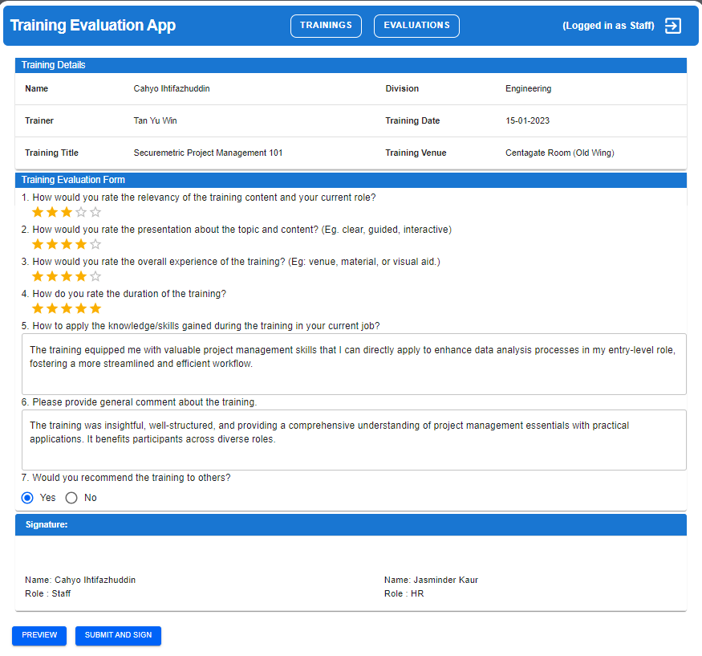

# Training Evaluation App

## Description

The Training Evaluation App is a simple app designed to showcase the use of digital signatures in the document flow, specifically in the context of staff training evaluations.

## Installation

### Prerequisites

- React 18.2.0 for front-end
- Material UI 5.14.20 for React UI library
- Python 3.x for back-end
- Docker for running MySQL server
- DataGrip or any preferred DBMS for MySQL

### Steps

1. Clone the repository: `git clone ihtifazhuddin/training-evaluation-app`
2. Set up the MySQL server using Docker: `docker-compose up` which located in back-end folder.
3. Connect to the MySQL database using DataGrip or your preferred DBMS.
4. Import the database by using mysqldump, import the file `import-with-mysqldump.sql`
5. Open the backend code in your IDE (e.g., PyCharm) and run `server.py`.
6. Open the frontend code in your IDE, open the terminal, and run `npm install` followed by `npm start`.

## Usage

1. Log in as a staff member to view and evaluate training sessions.
2. Submit the evaluation with a digital signature.
3. Log in as an HR member to view and approve evaluations with a digital signature.

## Features

- Staff can log in and view a list of training sessions conducted by the company.
- Staff can select a training session, fill out the evaluation form, and submit it to the system with a digital signature.
- Evaluations are sent to the respective HR for approval.
- HR can log in to view a list of evaluations submitted by staff and approve them with digital signature.
- Both staff and HR can view and download the evaluation document.

## Code Organization

The project is structured as follows:

- `src/`: This directory contains all the source code for the project.

  - `App.js`: This is the main entry point of the application. It sets up the React Router and defines the routes for the application. Each route corresponds to a different page in the application.
  - `common/`: This directory contains the components that are common to all users.
    - `components`: This directory contains layout such as main layout and header, and pages like login page and 404 page.
    - `functional-components`: This directory contains all functional components to call API from server.
  - `hr/`: This directory contains the pages that are only accessible to HR users. Currently, this includes the HR evaluation list page.
  - `staff/`: This directory contains the component that are only accessible to staff users.
    - `components`: This directory contains page components that are specific for staff process.
    - `pages`: This directory contains the training list page, the evaluation list page, and the evaluation creation page.
  - `test-files/`: This directory contains the tests or draft codes for the project.

- `package.json`: This file lists the project dependencies and scripts.

## Use Case

SigningCloud Sdn. Bhd. organizes several internal training sessions. After each training, employees are required to fill in evaluation forms to provide feedback to the organizer and trainer. To streamline the evaluation process and avoid burdensome email communications, the Training Evaluation App allows for effective process of the evaluation flow. The use of digital signatures ensures that documents are legally signed by both staff and HR which also demonstrate the versatility of digital signatures in various scenarios.

## Screenshots

Here are some screenshots of the application:

### Login Page

This is the page where users can log in to the app using their credentials.

### Training List Page

This is the page where staff members can view list and select training sessions.

### Evaluation Page

This is the page where staff members can view list and select training sessions.

### View Evaluation

<!--  -->

This is when staff or HR view the ongoing or completed evaluation document.

### HR Approval Page

This is the page where HR can view the list of submitted evaluations and approve them.

## Contributing

This app is maintained and developed by the creator and is not open for external contributions.
